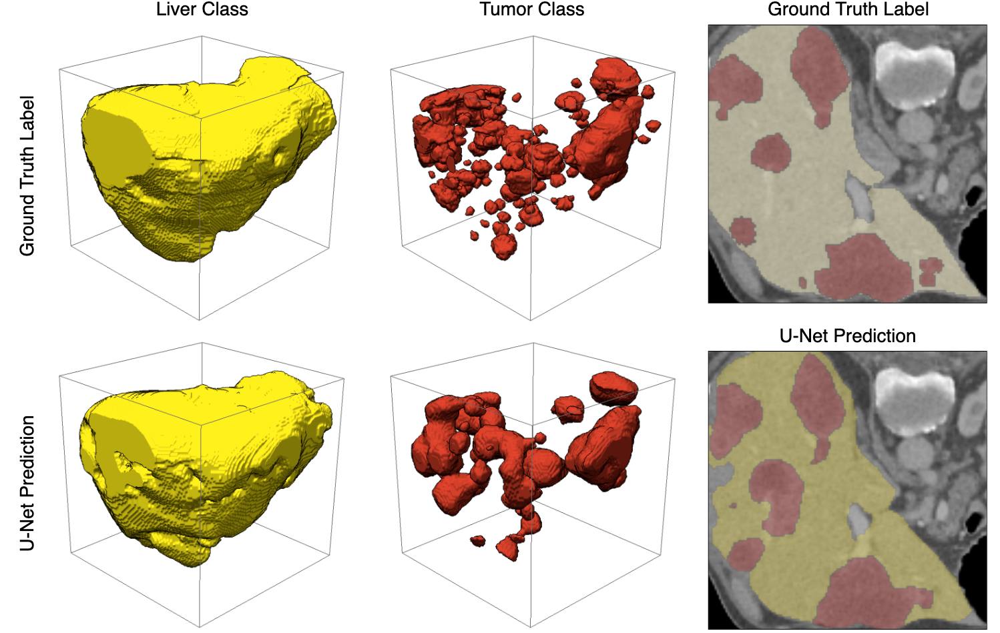
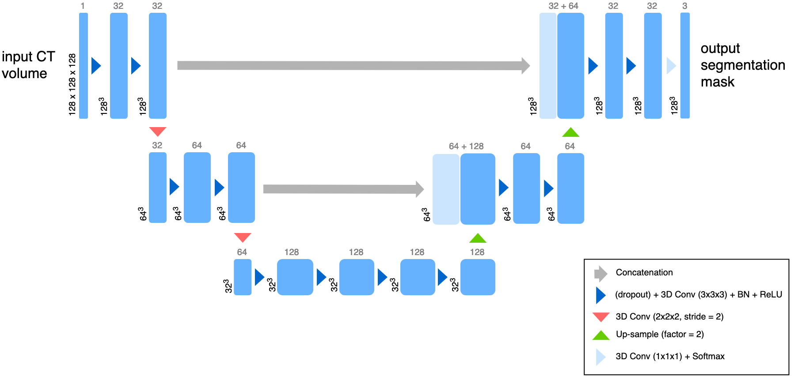

=====================
liver-ct-segmentation
=====================

.. image:: https://github.com/mlf-core/liver-ct-segmentation/workflows/Train%20liver-ct-segmentation%20using%20CPU/badge.svg
        :target: https://github.com/mlf-core/liver-ct-segmentation/actions?query=workflow%3A%22Train+liver-ct-segmentation+using+CPU%22
        :alt: Github Workflow CPU Training liver-ct-segmentation Status

.. image:: https://github.com/mlf-core/liver-ct-segmentation/workflows/Publish%20Container%20to%20Docker%20Packages/badge.svg
        :target: https://github.com/mlf-core/liver-ct-segmentation/actions?query=workflow%3A%22Publish+Container+to+Docker+Packages%22
        :alt: Publish Container to Docker Packages

.. image:: https://github.com/mlf-core/liver-ct-segmentation/workflows/mlf-core%20linting/badge.svg
        :target: https://github.com/mlf-core/liver-ct-segmentation/actions?query=workflow%3A%22mlf-core+lint%22
        :alt: mlf-core lint

.. image:: https://readthedocs.org/projects/liver-ct-segmentation/badge/?version=latest
        :target: https://liver-ct-segmentation.readthedocs.io/en/latest/?badge=latest
        :alt: Documentation Status

Liver-tumor segmentation of computed tomography scans using a U-Net model.

* Free software: MIT
* Documentation: https://liver-ct-segmentation.readthedocs.io.

A reproducible, Pytorch-based model for liver-tumor segmentation of computed tomography (CT) scans using a 3D `U-Net`_ architecture. This project uses the Liver Tumor Segmentation Benchmark (LiTS_) dataset to train a simplified U-Net model for semantic segmentation of liver and tumor tissue (background, liver, tumor) from abdominal CT scans.

Architecture
------------

A reduced 3D U-Net architecture. The U-Net is a convolutional “encoder-decoder” model for semantic segmentation of 2D and 3D images. In this simplified model, convolutional layers with a stride of 2 are used for down-sampling, while the up-sampling operation was performed with the nearest neighbor algorithm. Here, convolutions use filter sizes of 3x3x3, dropout is applied to every convolutional layer, and the softmax function is used on the last layer to produce class pseudo-probabilities. Blue boxes correspond to 3D multi-channel feature maps, with the number of channels denoted on top, and the size of the spatial dimensions marked in the lower left.

Credits
-------

This package was created with `mlf-core`_ using Cookiecutter_.

.. _U-Net: https://arxiv.org/abs/1606.06650
.. _LiTS: https://arxiv.org/abs/1901.04056
.. _mlf-core: https://mlf-core.readthedocs.io/en/latest/
.. _Cookiecutter: https://github.com/audreyr/cookiecutter

